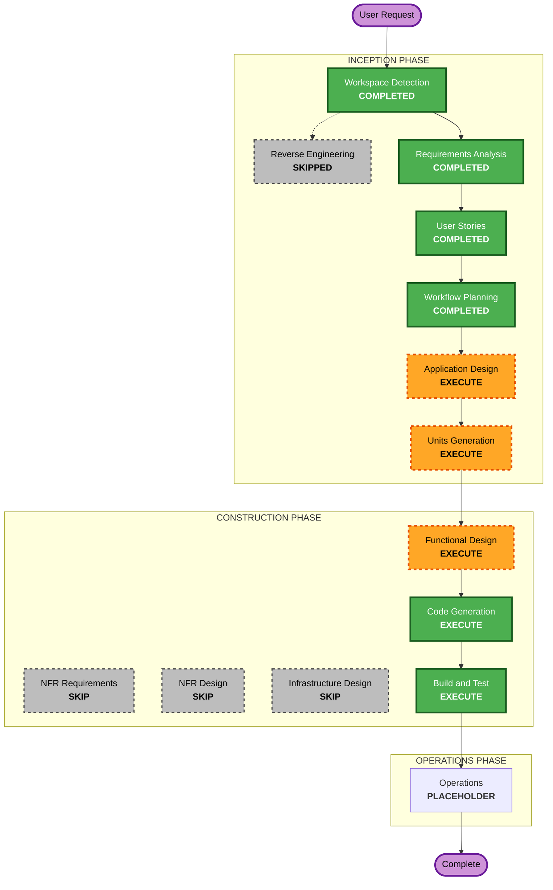

# Execution Plan — Hệ Thống Trắc Nghiệm Trực Tuyến

## Detailed Analysis Summary

### Change Impact Assessment
- **User-facing changes**: Yes — Toàn bộ dự án là UI frontend 
- **Structural changes**: Yes — 9 trang HTML + CSS + JS từ đầu
- **Data model changes**: Yes — Cần thiết kế cấu trúc data (User, Exam, Question, Result) cho localStorage
- **API changes**: N/A — Không có backend
- **NFR impact**: Minimal — CSS thuần, không server, không scale

### Risk Assessment
- **Risk Level**: Low
- **Rollback Complexity**: Easy (static files, không có DB thật)
- **Testing Complexity**: Simple (chạy trực tiếp trên trình duyệt)

---

## Workflow Visualization



### Text Alternative
```
INCEPTION PHASE:
  - Workspace Detection     [COMPLETED]
  - Reverse Engineering     [SKIPPED - Greenfield]
  - Requirements Analysis   [COMPLETED]
  - User Stories            [COMPLETED]
  - Workflow Planning       [COMPLETED]
  - Application Design      [EXECUTE]
  - Units Generation        [EXECUTE]

CONSTRUCTION PHASE (per unit):
  - Functional Design       [EXECUTE]
  - NFR Requirements        [SKIP]
  - NFR Design              [SKIP]
  - Infrastructure Design   [SKIP]
  - Code Generation         [EXECUTE - ALWAYS]
  - Build and Test          [EXECUTE - ALWAYS]

OPERATIONS PHASE:
  - Operations              [PLACEHOLDER]
```

---

## Phases to Execute

### 🔵 INCEPTION PHASE
- [x] Workspace Detection — COMPLETED
- [x] Reverse Engineering — SKIPPED (Greenfield, không có code cũ)
- [x] Requirements Analysis — COMPLETED
- [x] User Stories — COMPLETED
- [x] Workflow Planning — COMPLETED (IN PROGRESS)
- [ ] **Application Design — EXECUTE**
  - **Rationale**: Cần thiết kế 9 component pages mới với data models, service layer (localStorage), và luồng điều hướng giữa các trang
- [ ] **Units Generation — EXECUTE**
  - **Rationale**: Hệ thống gồm nhiều units độc lập (Auth, User Pages, Admin Pages, Shared Data Layer) cần phân rã rõ ràng trước khi code

### 🟢 CONSTRUCTION PHASE
- [ ] **Functional Design — EXECUTE** (per unit)
  - **Rationale**: Cần thiết kế cấu trúc data localStorage (User, Exam, Question, Result schemas) và business logic (tính điểm, timer) trước khi code
- [ ] NFR Requirements — SKIP
  - **Rationale**: Frontend tĩnh, không server, không có NFR phức tạp (performance, security, scalability không áp dụng)
- [ ] NFR Design — SKIP
  - **Rationale**: Không có NFR Requirements → bỏ qua NFR Design
- [ ] Infrastructure Design — SKIP
  - **Rationale**: Không có infrastructure (không server, không cloud, static files)
- [ ] **Code Generation — EXECUTE** (ALWAYS, per unit)
  - **Rationale**: Implementation toàn bộ HTML/CSS/JS cho 9 trang
- [ ] **Build and Test — EXECUTE** (ALWAYS)
  - **Rationale**: Hướng dẫn chạy và kiểm tra ứng dụng trong trình duyệt

### 🟡 OPERATIONS PHASE
- [ ] Operations — PLACEHOLDER (tương lai)

---

## Units Dự Kiến (sẽ xác nhận trong Units Generation)

| Unit | Nội dung |
|---|---|
| **Unit 1**: Shared Foundation | mock-data.js, main.css, auth guard logic |
| **Unit 2**: Authentication | login.html, register.html, admin/login.html |
| **Unit 3**: User — Exam Flow | index.html, exam.html, result.html |
| **Unit 4**: Admin — Core | admin/dashboard.html, admin/exam-editor.html |
| **Unit 5**: Admin — Reports | admin/statistics.html, admin/student-results.html |

---

## Estimated Timeline
- **Total Stages to Execute**: 5 (Application Design, Units Generation, Functional Design, Code Generation, Build & Test)
- **Estimated Duration**: 1 session (dự án frontend thuần)

## Success Criteria
- **Primary Goal**: 9 trang HTML hoạt động đầy đủ, mock data qua localStorage
- **Key Deliverables**: Tất cả file HTML/CSS/JS, mock-data.js, hướng dẫn chạy
- **Quality Gates**: Responsive, màu PTIT, validation JS, Chart.js charts, SheetJS import, jsPDF export
